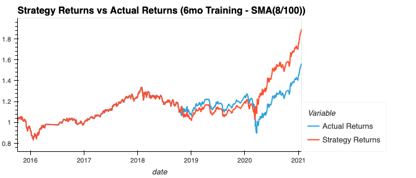

# Algorithmic Trading Bot (module_14_challenge)

A Jupyter notebook that contains an algorithmic trading bot that learns and adapts to new data and evolving markets.

The data set can be found in the [`Resources`](Resources/) folder:

- [emerging_markets_ohlcv.csv](Resources/emerging_markets_ohlcv.csv)

---

## Technologies

- python 3.7.10
- jupyterlab 3.0.14
- pandas 1.2.4
- numpy 1.19.5
- hvplot 0.7.3
- scikit-learn 0.24.1

---

## Evaluation Report

### Baseline performance

The baseline model used 3 momths of training data and had a fast window of 4 and a long window of 100. This model showed positive results when used to predit the test data, and the strategy was mostly in the green throughout the test period.

### What impact resulted from increasing or decreasing the training window?

Decreasing the training window to 2 months showed similar, but less positive results as compared to 3 months.

Increasing the training window to 6 months showed more positive results overall, but resulted in a period just over a year where the strategy was in the red.

### What impact resulted from increasing or decreasing either or both of the SMA windows?

Increasing or decreasing the SMA windows did not seem to make a big differences to the overall strategy returns as demonstrated in the following 4 images. None of the attempted changes resulted in a better model.

However, increasing the training window to 6 months and increasing the fast SMA window to 8 seemed to give the best results with the highest overall Strategy Returns.

### Evaluate A New Machine Learning Classifier

In looking at different Machine Learning Classifiers, the AdaBoostClassifier model performed the best with a slighlty higher cumulative return than the SVM Classifier model. The LogisitcRegression and DecisionTreeClassifier models both had a cumulative loss by the end of the testing period, however they olso have periods where they had cumulative gains over actual returns.

---

## Contributors

---

## License

GNU GPLv3
